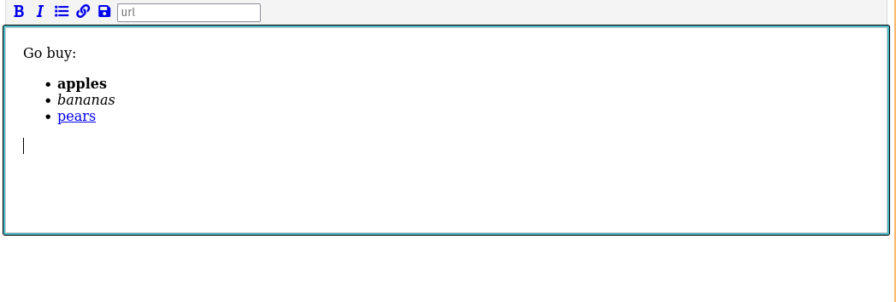

# javascript text editor

A simple design for a text editor design. Creates the illusion of a basic
text editor, but has no functionality yet.

## demo

## meta

Credits to [thesoftwaredude.com](https://www.thatsoftwaredude.com/content/8912/create-a-basic-text-editor-in-javascript) for the initial design.

So what about a `saveAs()` function?

- https://eligrey.com/blog/saving-generated-files-on-the-client-side/

What about the NativeFileAcess API?

- https://wicg.github.io/file-system-access/

